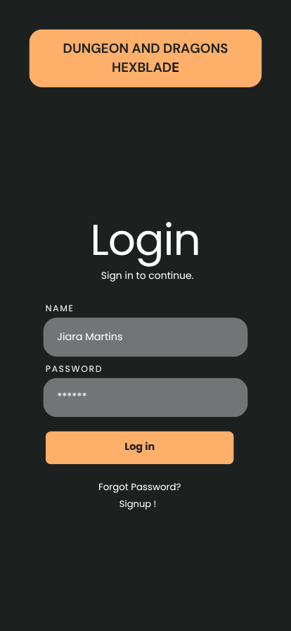
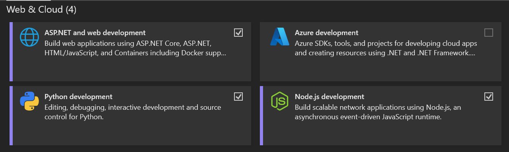
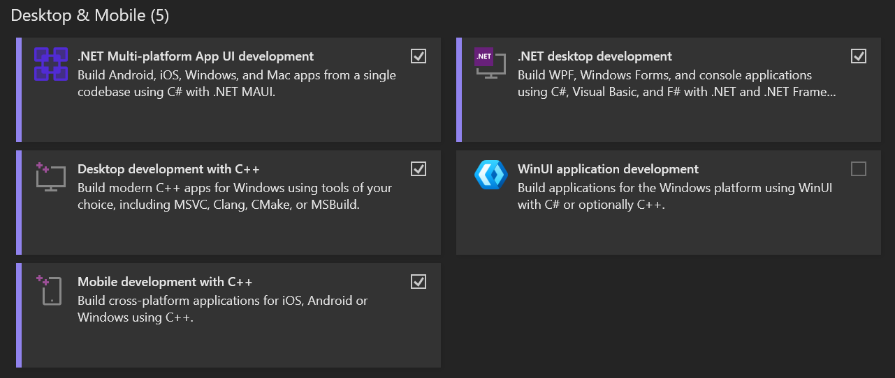
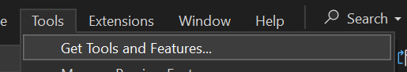
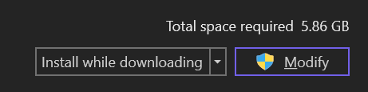
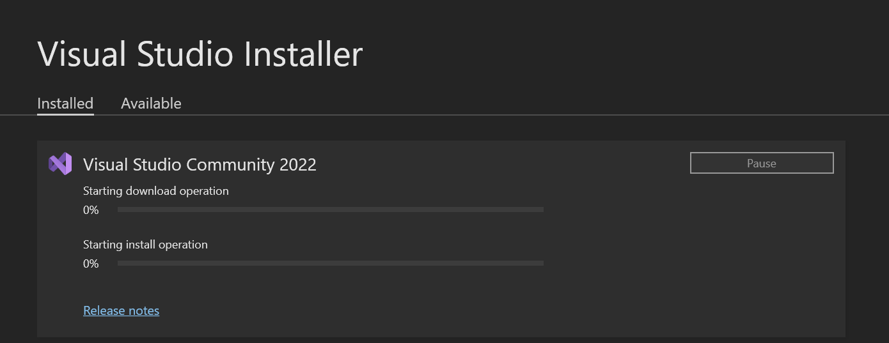

# Project Hexblade

Currently under the working title "Project Hexblade", this is a D&amp;D web-app
for use as a companion app for players to use at tables. D&amp;D can be a
complicated game to play sometimes, especially for newer players, and for
more advanced players, who like to tweak and change the systems to better
fit their ideas, this means adding their own variations to the rules, which can
make things even more confusing. Enter Project Hexblade, a modular, easy-to-use,
and easy-to-customize web-app. The idea is to have each "chunk" of the 
"character sheet" as a component, which can be easily modified or replaced by the user.

## Resources

- [General Resources](./Resources/general-resources.md)

- [Team Hexblade OneNote](https://algonquinlivecom-my.sharepoint.com/personal/solo0069_algonquinlive_com1/_layouts/15/Doc.aspx?sourcedoc={0fd92fe6-ab6f-4b02-abfd-3a3af722ea4d}&action=edit&wd=target%28Project%20Overview.one%7Cbbed25e5-0408-4cde-8fbc-d47303da112d%2FProject%20Hexblade%7Cf97a9684-4f3e-44c5-bce0-f7ca2dc9a206%2F%29&wdorigin=NavigationUrl)

- [Project Plan](https://algonquinlivecom-my.sharepoint.com/:w:/g/personal/solo0069_algonquinlive_com1/EaAdR2frTDtIjC6u5wN5hwEBWJzholk2NoyXQpoiVpnskw?e=3BuRMU)

- [Initial Repository](https://github.com/tjmoyes/project-hexblade)

## Frontend Design Ideas

### Logo Ideas

### Sample Character Sheet

### Sample Character Pages

### Login Page

## Backend Design / Structure Ideas

### ATK Modifier Logic

### HP Modifier Logic

### User-Character Entities and Relationship

## Dev IDE Setup

### Installation
The preferrable IDE for development is Visual Studio 2022 as it would be easy to install workloads needed.

VSCode can also be used but we will have to make note of the workloads/dependencies/extensions that are needed more specifically at another time.

#### Steps
When installing Visual Studio 2022, check the following workloads:

Under Web & Cloud
- ASP.NET and web development
- Python development
- Node.js development

Under Desktop & Mobile
- .NET Multi-platform App UI development
- .NET desktop development
- Desktop development with C++
- Mobile development with C++

Optionally, although highly recommended, you can also select the following under Other Toolsets

- Data storage and processing
- Visual Studio extension development
- Linux, Mac, and embedded development with C++

Once selected, continue installation as normal.

#### Check Workload Selections
If you think you forgot to select any workload, open Visual Studio and go to Tools > Get Tools and Features...

After this, you should see the Workloads screen once again and can check which packages you have selected. If by chance you missed one, you can select it and select Modify with the option to Install while downloading or Download all, then install - either choice should do the job.

Installation should now proceed as seen

