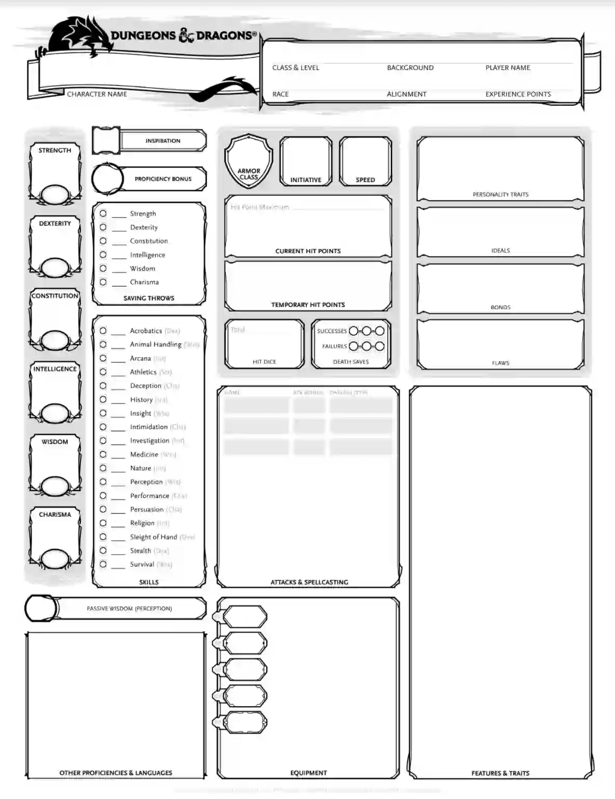
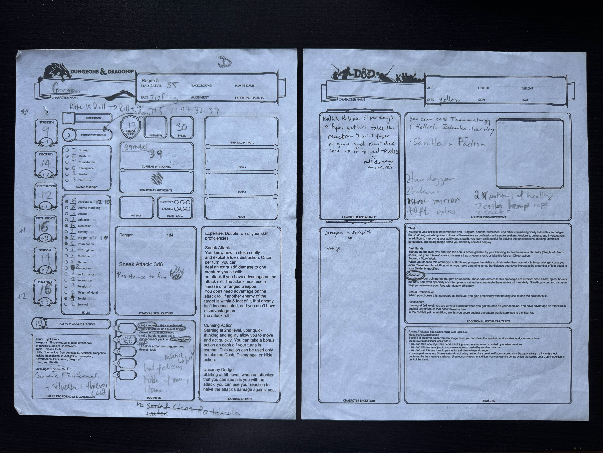
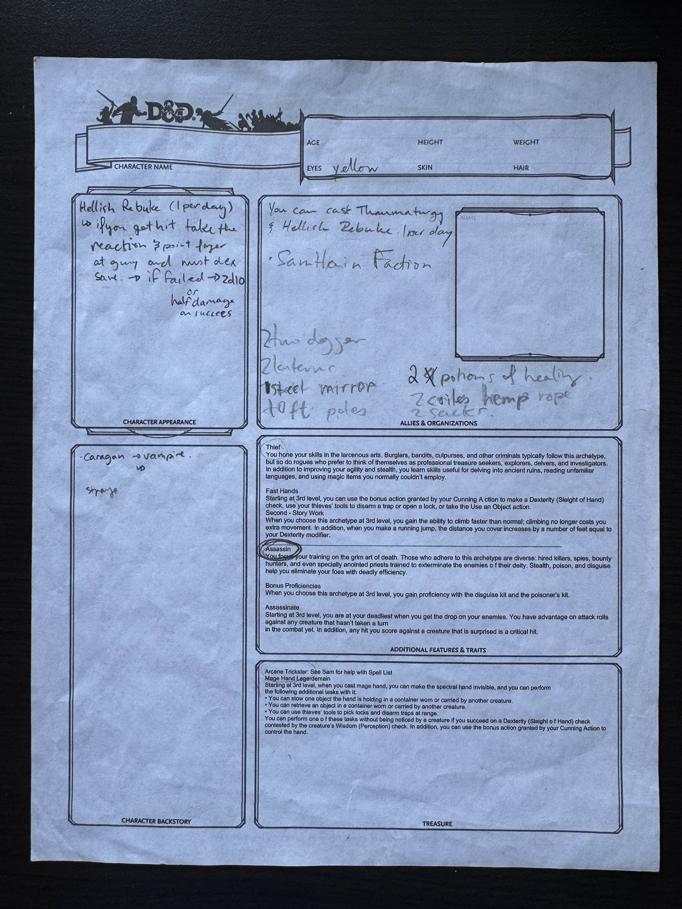
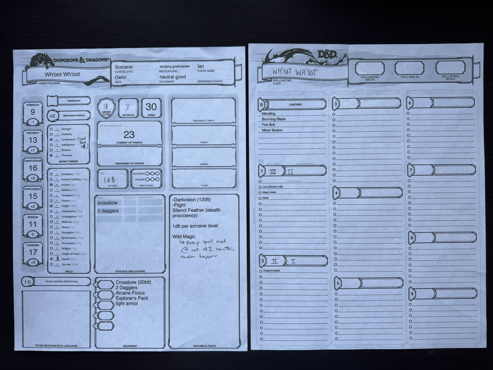
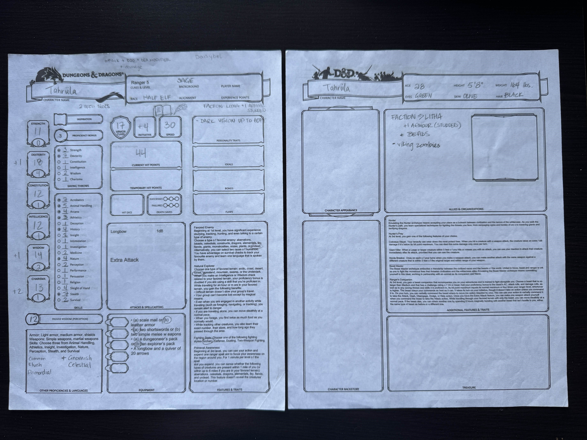

# General Resources

## Work Breakdown Structure (WBS)

## Learning Resources

- [LinkedIn Learning - .NET](https://www.linkedin.com/learning/topics/dot-net)

- [LinkedIn Learning - Python](https://www.linkedin.com/learning/topics/python)

- [LinkedIn Learning - ReactJS](https://www.linkedin.com/learning/topics/react-js)

## Inspirations

- [DMs Guild](https://www.dmsguild.com/)

- [DND Beyond](https://www.dndbeyond.com/)

- [Fight Club 5E](https://play.google.com/store/apps/details?id=com.lionsden.fc5&hl=en_CA)

- [5ETools](https://5e.tools/)

- [Foundry Virtual Tabletop](https://foundryvtt.com/)

- [Roll20](https://roll20.net/)

## Character Sheet Examples / Visual Inspos

